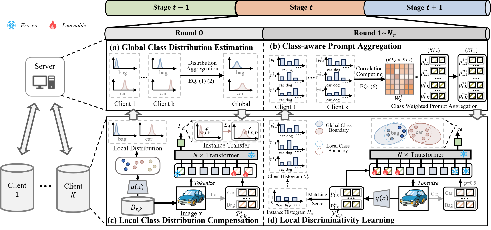
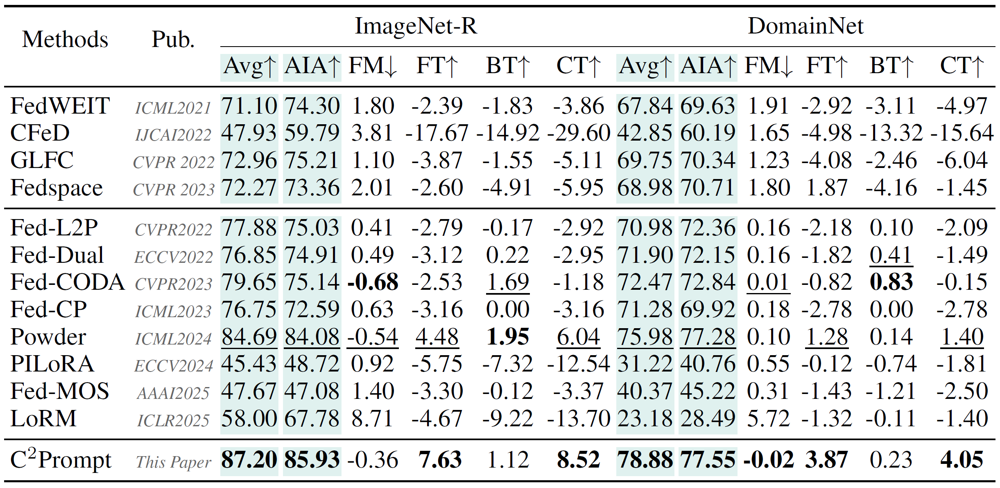

# [NeurIPS 2025] C<sup>2</sup>Prompt: Class-aware Client Knowledge Interaction for Federated Continual Learning

<div align="center">

<div>
      Kunlun Xu<sup>1</sup>&emsp; Yibo Feng<sup>1</sup>&emsp;  Jiangmeng Li<sup>2</sup>&emsp; Yongsheng Qi<sup>3</sup>&emsp; Jiahuan Zhou<sup>1*</sup>
  </div>
<div>

  <sup>1</sup>Wangxuan Institute of Computer Technology, Peking University&emsp; <sup>2</sup>University of Chinese Academy of Sciences&emsp; <sup>3</sup>Inner Mongolia University of Technology

</div>
</div>
<p align="center">
<a href='https://arxiv.org/abs/2509.19674'></a>
  <a href="https://github.com/zhoujiahuan1991/NeurIPS2025-C2Prompt"></a>
</p>

The *official* repository for  [C<sup>2</sup>Prompt: Class-aware Client Knowledge Interaction for Federated Continual Learning](https://openreview.net/pdf?id=pKqLOmF3Lf).



## Installation
```shell
conda create -n C2Prompt python=3.9
conda activate C2Prompt

pip install torch==2.4.1 torchvision==0.19.1 torchaudio==2.4.1 --index-url https://download.pytorch.org/whl/cu118

pip install -r requirements.txt
```


### Data and Model Preparation

This work primarily utilizes DomainNet, ImageNet-R. Among them, DomainNet, ImageNet-R are existing datasets. And you can download DomainNet at [here](https://ai.bu.edu/M3SDA/), ImageNet-R at [here](https://github.com/hendrycks/imagenet-r?tab=readme-ov-file)  


### Training
You can directly run the pre-written shell script:
```
sh scripts/run_imagenetr.sh
sh scripts/run_domainnet.sh
```
You can get the single task training results in:
```
sh scripts/run_imagenetr_direct.sh
sh scripts/run_domainnet_direct.sh
```
Compute the six metrics in our benchmark with `benchmark_metrics.py`. Note that 2 clients switch to new tasks every 3 rounds (start from round 0), thus we compute the six metrics every 3 rounds. First, please set the finished task id in `task_list_forward` and `task_list_backward`. Task id is calculated by `(round // 3) * num_clients + client_id`. Then, run the command and you will get the results:
```
python benchmark_metrics.py
```
Please refer to `option.py` for more introductions on arguments.

## Results
The following results were obtained with a single NVIDIA 4090 GPU:



## Citation
If you find this code useful for your research, please cite our paper.
```
@inproceedings{xu2025c2prompt,
  title={C $\^{} 2$ Prompt: Class-aware Client Knowledge Interaction for Federated Continual Learning},
  author={Xu, Kunlun and Li, Jiangmeng and Qi, Yongsheng and Zhou, Jiahuan and others},
  booktitle={The Thirty-ninth Annual Conference on Neural Information Processing Systems},
  year={2025}
}
```

### We have conducted a series of research in Continual Learning and Prompt Learning as follows.

#### Semi-Supervised Lifelong Learning:
```shell
@inproceedings{xu2025self,
  title={Self-Reinforcing Prototype Evolution with Dual-Knowledge Cooperation for Semi-Supervised Lifelong Person Re-Identification},
  author={Xu, Kunlun and Zhuo, Fan and Li, Jiangmeng and Zou, Xu and Jiahuan Zhou},
  booktitle={Proceedings of the IEEE/CVF International Conference on Computer Vision},
  year={2025}
}
```
#### Image-level Distribution Modeling and Transfer:
```shell
@inproceedings{xu2025dask,
  title={Dask: Distribution rehearsing via adaptive style kernel learning for exemplar-free lifelong person re-identification},
  author={Xu, Kunlun and Jiang, Chenghao and Xiong, Peixi and Peng, Yuxin and Zhou, Jiahuan},
  booktitle={Proceedings of the AAAI Conference on Artificial Intelligence},
  volume={39},
  number={9},
  pages={8915--8923},
  year={2025}
}
```
#### Feature-level Distribution Modeling and Prototyping:
```shell
@article{zhou2025distribution,
  title={Distribution-Aware Knowledge Aligning and Prototyping for Non-Exemplar Lifelong Person Re-Identification},
  author={Zhou, Jiahuan and Xu, Kunlun and Zhuo, Fan and Zou, Xu and Peng, Yuxin},
  journal={IEEE Transactions on Pattern Analysis and Machine Intelligence},
  year={2025},
  publisher={IEEE}
}

@inproceedings{xu2024distribution,
  title={Distribution-aware Knowledge Prototyping for Non-exemplar Lifelong Person Re-identification},
  author={Xu, Kunlun and Zou, Xu and Peng, Yuxin and Zhou, Jiahuan},
  booktitle={Proceedings of the IEEE/CVF Conference on Computer Vision and Pattern Recognition},
  pages={16604--16613},
  year={2024}
}
```
#### Long Short-Term Knowledge Rectification and Consolidation:
```shell
@article{xu2025long,
  title={Long Short-Term Knowledge Decomposition and Consolidation for Lifelong Person Re-Identification},
  author={Xu, Kunlun and Liu, Zichen and Zou, Xu and Peng, Yuxin and Zhou, Jiahuan},
  journal={IEEE Transactions on Pattern Analysis and Machine Intelligence},
  year={2025},
  publisher={IEEE}
}


@inproceedings{xu2024lstkc,
  title={Lstkc: Long short-term knowledge consolidation for lifelong person re-identification},
  author={Xu, Kunlun and Zou, Xu and Zhou, Jiahuan},
  booktitle={Proceedings of the AAAI Conference on Artificial Intelligence},
  volume={38},
  number={14},
  pages={16202--16210},
  year={2024}
}
```
#### Lifelong Learning with Label Noise:
```shell 
@inproceedings{xu2024mitigate,
  title={Mitigate Catastrophic Remembering via Continual Knowledge Purification for Noisy Lifelong Person Re-Identification},
  author={Xu, Kunlun and Zhang, Haozhuo and Li, Yu and Peng, Yuxin and Zhou, Jiahuan},
  booktitle={Proceedings of the 32nd ACM International Conference on Multimedia},
  pages={5790--5799},
  year={2024}
}
```

#### Prompt-guided Adaptive Knowledge Consolidation:
```shell
@article{li2024exemplar,
  title={Exemplar-Free Lifelong Person Re-identification via Prompt-Guided Adaptive Knowledge Consolidation},
  author={Li, Qiwei and Xu, Kunlun and Peng, Yuxin and Zhou, Jiahuan},
  journal={International Journal of Computer Vision},
  pages={1--16},
  year={2024},
  publisher={Springer}
}
```

#### Compatible Lifelong Learning:
```shell
@inproceedings{cui2024learning,
  title={Learning Continual Compatible Representation for Re-indexing Free Lifelong Person Re-identification},
  author={Cui, Zhenyu and Zhou, Jiahuan and Wang, Xun and Zhu, Manyu and Peng, Yuxin},
  booktitle={Proceedings of the IEEE/CVF Conference on Computer Vision and Pattern Recognition},
  pages={16614--16623},
  year={2024}
}
```


## Acknowledgement
Our code is based on the PyTorch implementation of [Powder](https://github.com/piaohongming/Powder).

## Contact

For any questions, feel free to contact us (xkl@stu.pku.edu.cn).

Welcome to our [Laboratory Homepage](http://www.icst.pku.edu.cn/mipl/home/) and [OV<sup>3</sup> Lab](https://zhoujiahuan1991.github.io/) for more information about our papers, source codes, and datasets.
