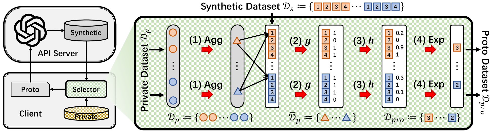
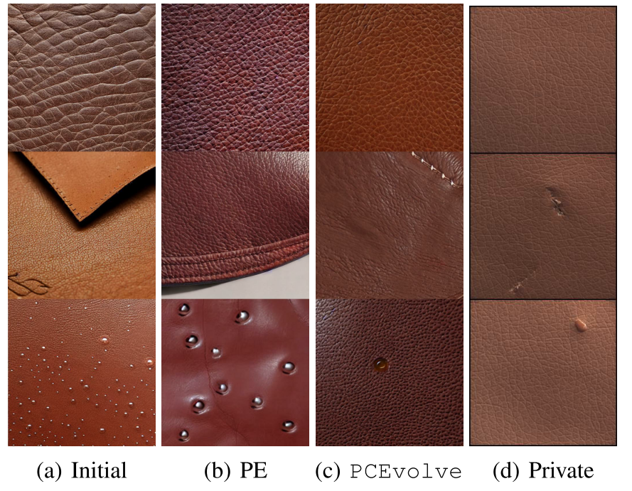

## Introduction

This repository provides the official implementation of our paper, *[PCEvolve: Private Contrastive Evolution for Synthetic Dataset Generation via Few-Shot Private Data and Generative APIs](https://arxiv.org/abs/2506.05407)*—accepted as a **spotlight paper (top 2.6%) at ICML 2025**. The project builds upon our open-sourced framework, [EvolveGen](https://github.com/TsingZ0/EvolveGen), which contains core baselines and essential utilities. For ongoing updates and maintenance, please refer to [EvolveGen](https://github.com/TsingZ0/EvolveGen). 

- [Slides](./PCEvolve_slides.pdf)
- [Poster](./PCEvolve_poster.png)


Illustration of our PCEvolve, whose core is the DP-protected selector. Different colors denote distinct data classes (two classes are explicitly shown, with others indicated by “. . .”). “Agg” and “Exp” denote the class center aggregation and
the exponential mechanism, respectively.


Generated leather surface images w.r.t. MVAD-l for industry anomaly detection. The three rows show normal images, cut defects, and droplet defects. “Initial” denotes the initial synthetic images in PE and PCEvolve. “Private” denotes the real images from MVAD-l.

## Preparation

1. **Prepare the Required Large Model APIs (Skip If Using Online APIs).**  
   - Set up large model APIs either through local deployment (downloading model weights for captioner, generator, LLM, etc.) or via online-accessible APIs. 

2. **Set Up the Environment**  
   - Install [CUDA](https://docs.nvidia.com/cuda/cuda-toolkit-release-notes/index.html).  
   - Install the [latest Conda](https://repo.anaconda.com/miniconda/Miniconda3-latest-Linux-x86_64.sh) and activate it.  
   - Create the Conda environment:  
     ```bash  
     conda env create -f env_cuda_latest.yaml  
     # You may need to downgrade PyTorch using pip to match the CUDA version  
     ```  

## Run the Code

For a COVID-19 pneumonia detection task, generate 100 synthetic images per class based on 10 real and **private chest radiography (X-ray) images** on the edge using the Stable Diffusion API. The edge device utilizes a ResNet-18, with Private Contrastive Evolution (PCEvolve) for selection and feedback provided with privacy protection:
```bash  
python -u main.py \
  -tt syn \        # Task Type: Only using the synthetic dataset for downstream task
  -tm I2I \        # Task Mode: Image to Image
  -f Feedback \    # Framework: Feedback mechanism
  -did 1 \         # GPU device ID
  -eps 0.2 \       # Privacy budget epsilon per iteration
  -rvpl 1 \        # Real and private volume per label
  -vpl 2 \         # Generated volume per label
  -sgen StableDiffusion \  # Select StableDiffusion as the generative model
  -cret 1 \        # Other hyperparameter
  -cue ResNet18 \  # Edge client embedding model
  -cmodel ResNet18 \  # Edge client model
  -cmp 1 \         # Other hyperparameter
  -cef 1 \         # Other hyperparameter
  -cdata COVIDx \  # Private dataset
  -s PCEvolve \    # Synthetic data selector: Private Contrastive Evolution
  -tau 10          # Similarity calibrating factor
```  